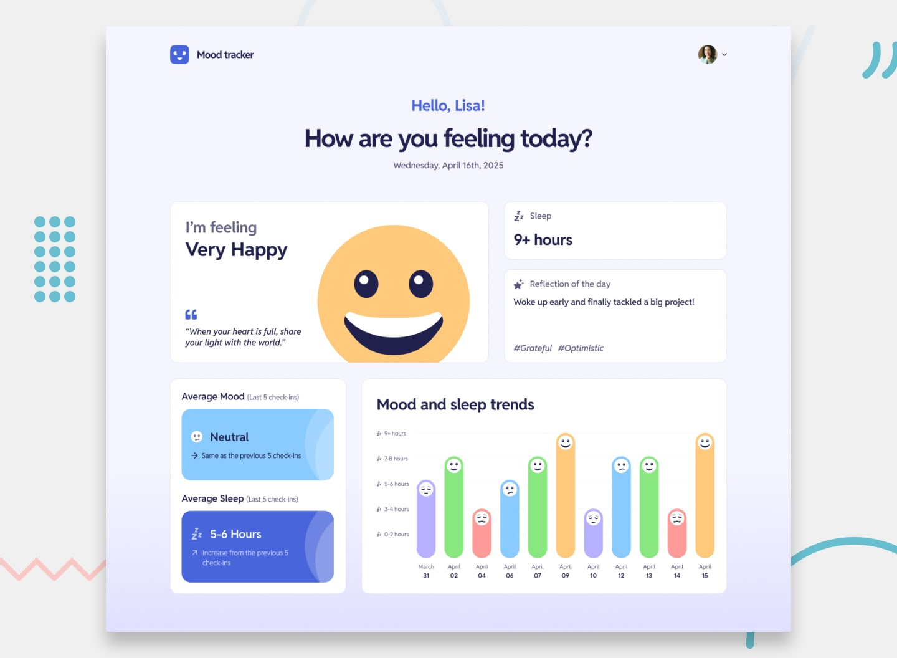

# Frontend Mentor - Mood tracking app

## Links

- Solution URL: [GitHub](https://github.com/dar-ju/dar-ju.github.io/tree/main/FM_32_mood-tracking)
- Live Site URL: [GitHub Pages](https://dar-ju.github.io/FM_32_mood-tracking/)

## Built with

### Frontend

- VUE Framework
- Vite
- Pinia
- Typescript
- Bootstrap
- API
- Semantic HTML5 markup
- SASS/SCSS
- BEM

### Backend

- Node.js
- MySQL
- Cloudinary
