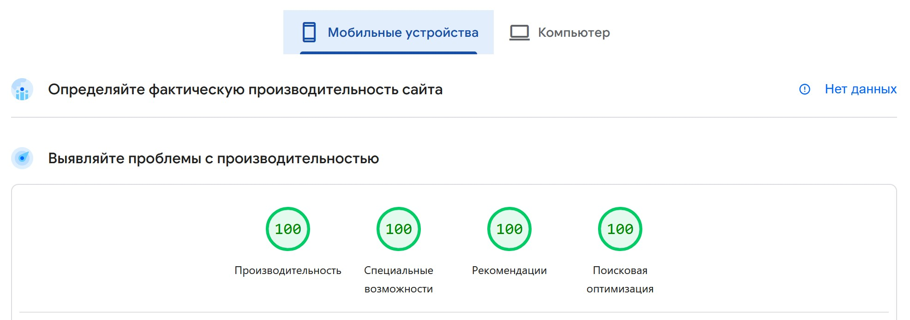

# Frontend Mentor - Designo agency website

## Links

- Solution URL: [GitHub](https://github.com/dar-ju/dar-ju.github.io/tree/main/FM_33_designo-multipage)
- Live Site URL: [GitHub Pages](https://dar-ju.github.io/FM_33_designo-multipage/build/)

## Built with

- Parcel
- Posthtml
- Semantic HTML5 markup
- SASS/SCSS
- BEM
- Responsive layout 375-1920px
- PerfectPixel
